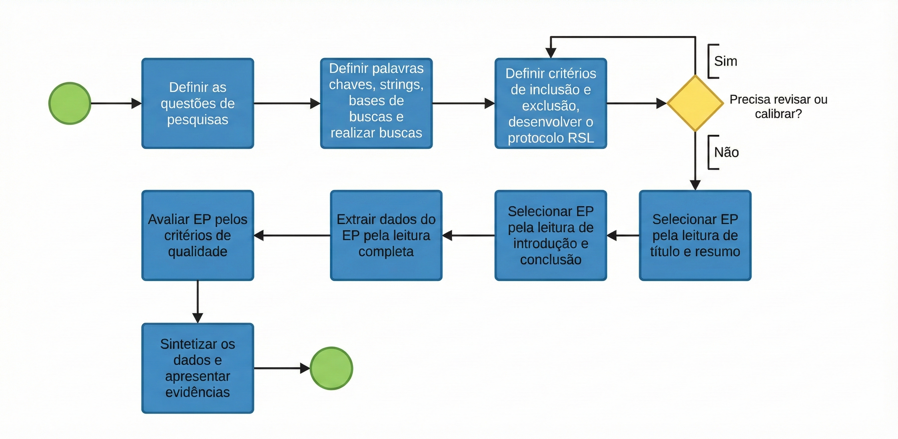
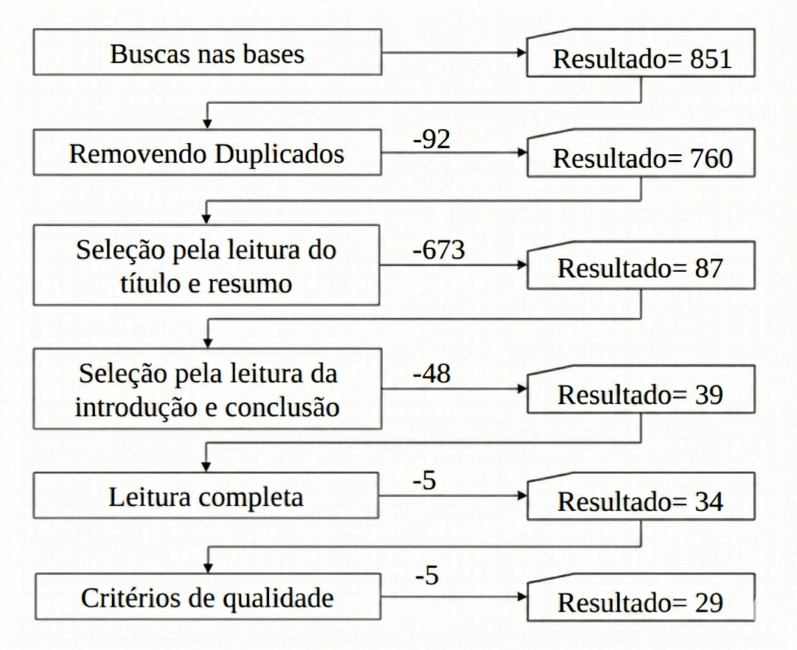

::: IEEEkeywords
Microservices; Kubernetes; Cryptography; Information Security
:::

# Introduction

The rapid evolution of software architectures has driven a massive
migration from monolithic systems to microservices-based architectures,
motivated by the need for horizontal scalability, development agility,
and operational resilience. In this context of digital transformation,
Kubernetes has established itself as the de facto standard for container
orchestration. However, this paradigm shift has dissolved the
traditional security perimeter: edge-based security (*edge security*)
has become insufficient in the face of a complex network of distributed,
ephemeral, and dynamic services, drastically expanding the attack
surface available to malicious actors.

The inherent complexity of managing microservices often results in
inadequate security configurations and inefficient credential
management. Technical literature indicates that the lack of proper
isolation allows simple vulnerabilities to escalate into full
infrastructure compromises through lateral movement. Consequently, it
becomes imperative to adopt practical guidelines that assist
professionals in implementing architectures that are both resilient and
secure, aligned with the principles of *Zero Trust* and Defense in
Depth.

Despite the abundance of security tools available on the market, there
is a gap in the consolidation of evidence regarding which strategies are
truly effective at mitigating risks without degrading system
performance. To address this challenge, this work presents a Systematic
Literature Review (SLR), conducted to investigate the state of the art
of vulnerabilities in orchestrated environments and the cryptographic
countermeasures proposed by academia and industry. The study
specifically focuses on hardening techniques such as mutual encrypted
communication (mTLS), automated secrets rotation, and the enforcement of
restrictive network policies.

The main contributions of this work include:

- The identification and categorization of the most recurrent security
  vulnerabilities in Kubernetes *clusters*;

- The analysis of cryptography-based countermeasures and their
  empirically validated effectiveness;

- The consolidation of a set of recommended practices to reduce the
  attack surface in distributed systems.

The remainder of this article is organized as follows: Section 2
presents the Theoretical Background on microservices concepts and
security challenges within the Kubernetes ecosystem; Section 3 details
the methodological protocol and execution of the SLR; Section 4
discusses the obtained results, correlating vulnerabilities and
mitigations; finally, Section 5 concludes the work and outlines
directions for future research.

# Theoretical Background

## Microservices and Kubernetes

The microservices architecture divides applications into small,
independent components that communicate through well-defined APIs.
Kubernetes acts as the orchestrator of these components (containers),
managing deployment, scaling, and operations. Although it provides
operational robustness, the dynamic nature of pods and services makes
the application of traditional security perimeters more challenging.

## Security and Cryptography in Distributed Environments

Security in Kubernetes environments is based on the principle of defense
in depth. Critical elements include the protection of east--west
communication (between services) and north--south traffic (ingress and
egress). The use of cryptography is central to ensuring confidentiality
and integrity, making the implementation of protocols such as mTLS
(mutual TLS) and secure key and secrets management (credential rotation)
essential to mitigate risks of data leakage and unauthorized access.
Vulnerability analysis tools, such as Kube-hunter and Kube-bench, are
frequently cited as means of validating the security posture of these
environments.

# Systematic Literature Review {#AA}

There are several reasons that justify conducting a Systematic
Literature Review (SLR). Briefly, an SLR makes it possible to summarize
existing evidence on a given area, identify gaps that require further
investigation, and provide a solid foundation for new research
activities. Unlike an ad-hoc review, the conduction of an SLR must be
carried out in a fair and auditable manner, following a predefined
research strategy that allows the assessment of research integrity and
the mitigation of bias in study selection.

The review process involves a series of discrete activities conducted
across different phases. These phases must follow a sequential execution
order (planning, conducting, and reporting); however, activities
initiated during protocol development may be refined in later phases as
domain understanding increases. For this study, the steps for conducting
the systematic review protocol were followed as presented in Figure
[1](#fig:etapas_rsl){reference-type="ref" reference="fig:etapas_rsl"},
adhering to the guidelines and recommendations for software engineering
proposed by Kitchenham.

<figure id="fig:etapas_rsl" data-latex-placement="h!">

<figcaption>Flowchart of the Systematic Literature Review
stages</figcaption>
</figure>

Initially, the protocol was developed using the PICOC strategy
(*Population, Intervention, Comparison, Outcome, Context*) to structure
the scope of the investigation and define the guiding Research Question
(RQ): \"How can the application of cryptographic countermeasures
mitigate vulnerabilities in Kubernetes environments?\"

To answer this question, the search sources were selected based on their
relevance and importance to the fields of Computer Science and Software
Engineering. The digital databases chosen for primary study extraction
were: **IEEE Xplore**, **ACM Digital Library**, and **Web of Science**.

Based on the research question and the PICOC strategy, keywords (such as
\"Microservices\", \"Kubernetes\", \"Security\", and \"Cryptography\")
and their respective synonyms were defined to compose the search
*strings*. The construction of the search queries used the logical
operator `OR` to group synonyms and the `AND` operator to connect
different contextual terms, ensuring that the returned results addressed
the intersection of microservices, orchestration, and security.

## Planning and Protocol

The overall objective of the SLR is to contribute to the establishment
of practical security guidelines for microservices. The research
question (RQ) is presented in Table
[1](#tab:questoes_pesquisa){reference-type="ref"
reference="tab:questoes_pesquisa"}.

::: {#tab:questoes_pesquisa}
  ------------------------------------------------------------------
  RQ1   How can the application of a set of countermeasures based on
        cryptographic techniques and secure architecture patterns
        effectively mitigate the most recurrent security
        vulnerabilities in a Kubernetes-orchestrated microservices
        architecture?
  ----- ------------------------------------------------------------

  ------------------------------------------------------------------

  : Research Question
:::

## Sources and Search Strategy

The searches were conducted in three digital databases selected for
their relevance and high impact factor in the field of Computer Science:
*ACM Digital Library*, *IEEE Xplore*, and *Web of Science*. The
selection of these sources aims to ensure coverage of studies with high
technical quality and academic rigor.

The search strategy was designed to capture the intersection of three
main domains: software architecture (microservices), orchestration
(Kubernetes), and the objective of the intervention (security). To this
end, the search *string* was constructed using Boolean operators, where
the `OR` operator groups synonyms and related terms, and the `AND`
operator connects the different contextual groups. Table
[2](#tab:string_busca){reference-type="ref"
reference="tab:string_busca"} presents the generic search *string*
applied to the databases.

::: {#tab:string_busca}
  ---------------------------------------------------------------------------------------------------------------------------------------------------------------------------------------
  **Search String**
  ---------------------------------------------------------------------------------------------------------------------------------------------------------------------------------------
  `("microservices" OR "microservice architecture" OR "service-based architecture") AND (Kubernetes OR K8s OR "container orchestration") AND (security OR cybersecurity OR protection)`

  ---------------------------------------------------------------------------------------------------------------------------------------------------------------------------------------

  : Search String Used
:::

## Selection Criteria

The rigorous definition of selection criteria is essential to reduce
bias and ensure that only relevant and high-quality studies are
analyzed. To filter the studies retrieved from the databases, inclusion
(IC) and exclusion (EC) criteria were established, aligned with the
Research Question and the objective of investigating security
countermeasures in orchestrated environments.

The Inclusion Criteria, presented in Table
[3](#tab:criterios_inclusao){reference-type="ref"
reference="tab:criterios_inclusao"}, were designed to select primary and
secondary studies that provide empirical evidence or concrete technical
proposals.

::: {#tab:criterios_inclusao}
  ---------------------------------------------------------------------
  **ID**   **Criterion Description**
  -------- ------------------------------------------------------------
  IC1      The article must be a primary study (e.g., experimental
           study, case study, solution evaluation) or a systematic
           secondary study (review or mapping).

  IC2      The work must have been published in journals, conferences,
           or workshops and subjected to a peer-review process.

  IC3      The study must be written in the English language.

  IC4      The study must directly address security issues in the
           context of microservices architectures or
           Kubernetes-orchestrated environments.

  IC5      The work must propose, evaluate, analyze, or compare
           countermeasures, tools, or frameworks aimed at mitigating
           vulnerabilities.
  ---------------------------------------------------------------------

  : Inclusion Criteria
:::

On the other hand, the Exclusion Criteria, detailed in Table
[4](#tab:criterios_exclusao){reference-type="ref"
reference="tab:criterios_exclusao"}, aim to eliminate noise, redundancy,
and literature that does not meet the required standards of scientific
rigor or technical scope.

::: {#tab:criterios_exclusao}
  ---------------------------------------------------------------------
  **ID**   **Criterion Description**
  -------- ------------------------------------------------------------
  EC1      Articles whose full text is not available for access or
           download.

  EC2      Duplicate studies found across different databases
           (considering only the most complete version or the most
           recent publication).

  EC3      Studies that discuss security exclusively in the context of
           monolithic systems or generic cloud infrastructure, without
           a specific focus on containers or orchestration.

  EC4      Publications classified as grey literature, including
           editorials, book reviews, tutorials, opinion articles, and
           marketing white papers.
  ---------------------------------------------------------------------

  : Exclusion Criteria
:::

## Quality Assessment

After selecting the primary studies using the inclusion and exclusion
criteria, a Quality Assessment (QA) stage was conducted on the remaining
full-text articles. The objective of this stage is not only to filter
out studies with low methodological quality, but also to weigh the
relevance of each work in answering the defined Research Question.

To ensure evaluation consistency, a checklist composed of ten control
questions (QA1 to QA10) was developed. These questions were designed to
assess aspects ranging from the clarity of the justification and
empirical grounding to the replicability of experiments. For each
question, a score was assigned based on a ternary scale, as commonly
adopted in systematic literature reviews:

- **Yes (1.0 point):** The study fully meets the evaluated criterion.

- **Partial (0.5 point):** The study partially meets the criterion or
  does so with limitations.

- **No (0.0 point):** The study does not provide evidence of meeting the
  criterion or the information is unclear.

Table [5](#tab:qa_checklist){reference-type="ref"
reference="tab:qa_checklist"} presents in detail the questions that
compose the applied quality assessment checklist. Questions such as QA5
and QA10 received special attention, as they assess the description of
the experimental environment and the replicability of the
countermeasures, which are crucial aspects for validating security
solutions in Kubernetes environments.

::: {#tab:qa_checklist}
  ---------------------------------------------------------------------
  **ID**   **Assessment Question**
  -------- ------------------------------------------------------------
  QA1      Does the study present a clear justification for
           investigating security or vulnerabilities in microservices
           architectures and/or Kubernetes environments?

  QA2      Is the study grounded in empirical research (experiments,
           tests, case studies) rather than solely on authors' opinion
           or experience?

  QA3      Are the objectives related to vulnerability mitigation,
           application of cryptographic countermeasures, or security
           improvement clearly defined?

  QA4      Is the adopted approach or methodology (e.g., tools,
           cryptographic techniques, network policies, attack
           simulations) clearly described?

  QA5      Is the experimental or testing environment (e.g., Kubernetes
           cluster, tools such as Kube-hunter/Kube-bench, microservices
           configuration) clearly described?

  QA6      Is the level of contextual detail adequate --- including
           information about the environment type (laboratory, cloud,
           production) and the components used?

  QA7      Does the study present an analysis or discussion of the
           obtained results (e.g., impact of countermeasures,
           vulnerability reduction, performance)?

  QA8      Are the study limitations clearly stated (e.g., tool
           constraints, limited scope, unaddressed scenarios)?

  QA9      Does the study identify gaps or open problems in
           microservices and Kubernetes security, suggesting directions
           for future research?

  QA10     Does the study provide sufficient detail to allow
           replication of experiments or application of the proposed
           countermeasures?
  ---------------------------------------------------------------------

  : Quality Assessment Checklist
:::

# Results and Discussion

## Study Selection Process

The identification phase, carried out through the application of the
search *strings* across the digital databases, returned an initial
volume of 851 publications. The quantitative distribution by source
consisted of 551 records from the ACM Digital Library, 133 from IEEE
Xplore, and 167 from Web of Science.

The refinement and selection process of the primary studies followed a
rigorous filtering workflow divided into three screening stages, as
illustrated in detail in Figure
[2](#fig:selecao_artigos){reference-type="ref"
reference="fig:selecao_artigos"}.

<figure id="fig:selecao_artigos" data-latex-placement="h!">

<figcaption>Flowchart of the study selection and filtering
process</figcaption>
</figure>

In the first stage, focused on the initial screening, duplicates were
removed and the inclusion and exclusion criteria were applied to the
titles and abstracts of the publications. This procedure reduced the
initial dataset to 87 articles considered preliminarily relevant.

Subsequently, a more in-depth verification of alignment with the
Research Question was conducted through the reading of the introduction
and conclusion sections. This eligibility stage resulted in the approval
of 36 articles. Finally, the remaining studies were subjected to
full-text reading and evaluated according to the previously defined
methodological quality checklist. At the end of this process, 29 studies
were selected to compose the body of analysis of this systematic review
and to proceed to the data extraction phase.

## Analysis of Extracted Data

The data extraction phase was conducted with the objective of
synthesizing the empirical evidence found in the 29 selected primary
studies. To structure the analysis, the information was categorized into
three thematic axes defined in the research protocol: (i) the most
prevalent security vulnerabilities in orchestrated environments; (ii)
the proposed mitigation strategies and cryptographic countermeasures;
and (iii) the metrics and methods used to validate the effectiveness of
these solutions.

### Recurring Vulnerabilities and Attack Surface

The qualitative analysis of the studies consistently indicates that the
transition from monolithic architectures to microservices results in a
significant expansion of the attack surface. Unlike traditional systems
protected by a single network perimeter, Kubernetes environments expose
multiple entry points. The vulnerabilities most frequently cited in the
analyzed *corpus* can be grouped into three critical categories:

### Recurring Vulnerabilities and Attack Surface

The qualitative analysis of the studies consistently indicates that the
transition from monolithic architectures to microservices results in a
significant expansion of the attack surface. The most frequently cited
vulnerabilities include:

- **Insecure Default Configurations:** A significant portion of the
  studies highlights that Kubernetes *clusters*, when deployed with
  default configurations, prioritize usability over security. This
  includes overly permissive settings and exposed ports.

- **Unencrypted East--West Communication:** Internal service-to-service
  communication frequently occurs in plain text (HTTP). Studies warn
  that the absence of encryption facilitates data interception and
  *Man-in-the-Middle* (MitM) attacks, enabling lateral movement.

- **Inadequate Secrets Management:** Credential management is identified
  as a critical weakness. Practices such as hardcoded secrets or storing
  credentials in unprotected environment variables are primary vectors
  for infrastructure compromise.

### Countermeasures and Mitigation Strategies

In response to Research Question 1 (RQ1), the literature converges on
the adoption of a \"Defense in Depth\" approach, in which cryptography
plays a central role in ensuring confidentiality and integrity. The most
effective countermeasures identified in the studies include:

- **Mutual TLS (mTLS):** Widely advocated as the gold standard for
  service security, mTLS goes beyond traffic encryption. It establishes
  a strong cryptographic identity for each microservice by requiring
  mutual authentication before any data exchange occurs. This
  effectively mitigates spoofing and interception attacks.

- **Dynamic Secrets Management and Rotation:** To address the
  vulnerability of static credentials, studies propose the integration
  of digital vaults (*Vaults*) with Kubernetes. Automated rotation of
  secrets and cryptographic keys is highlighted as essential to limiting
  the blast radius in the event of credential leakage, thereby reducing
  the attackers' window of opportunity.

- **Network Policies:** Acting as an internal firewall, the
  implementation of restrictive network policies based on the \"Zero
  Trust\" principle complements cryptography. Logical isolation of
  *namespaces* and segmentation of *pods* prevent a compromised service
  from freely communicating with unrelated system components.

### Effectiveness Evaluation and Metrics

To validate the proposed countermeasures, most of the selected studies
adopted experimental methodologies in controlled environments.
Effectiveness was generally assessed through two complementary
approaches:

First, the **reduction of exploitable vulnerabilities** was quantified
using industry benchmark tools such as **Kube-hunter** (for penetration
testing) and **Kube-bench** (for compliance verification with CIS ---
*Center for Internet Security* --- benchmarks). The results indicate
that the combined application of the aforementioned countermeasures
significantly improves the security score of the *cluster*.

Second, several studies analyzed the **performance impact** (*overhead*)
by measuring request latency and throughput after the introduction of
encryption mechanisms (mTLS). The consensus in the literature is that,
although security introduces additional computational overhead, the
impact is justifiable given the critical increase in system resilience
against both internal and external attacks.

# Conclusion

The adoption of microservices architectures orchestrated by Kubernetes
represents a major milestone in the modernization of enterprise
applications, offering unprecedented scalability and resilience.
However, this technological advancement introduces operational
complexity that requires a paradigm shift in information security:
traditional perimeter-based protection is no longer sufficient to
address the highly dynamic, distributed, and ephemeral nature of
cloud-native environments.

This Systematic Literature Review (SLR), conducted through a rigorous
and reproducible protocol that filtered and analyzed 29 primary studies
from an initial pool of 851 publications, enabled a comprehensive
mapping of the state of the art regarding security vulnerabilities and
countermeasures in Kubernetes-based microservices architectures. The
synthesized evidence consistently confirms that practices such as
"security through obscurity" or reliance on default configurations
constitute critical risk vectors, frequently exploited in real-world
attack scenarios.

The results demonstrate that the robustness of such environments is
strongly dependent on the adoption of a defense-in-depth strategy
grounded in three essential pillars: (i) pervasive encryption through
mutual TLS (mTLS) to protect east--west traffic and prevent traffic
interception and lateral movement; (ii) dynamic and centralized secrets
management mechanisms to mitigate the risks associated with hard-coded
or long-lived credentials; and (iii) the enforcement of restrictive
network policies aligned with the *Zero Trust* model, effectively
reducing implicit trust between services and minimizing the blast radius
of potential compromises.

Beyond identifying and categorizing mitigation techniques, this study
achieved its objective of consolidating practical and actionable
security guidelines that can support architects, DevOps teams, and
security engineers in systematically reducing the attack surface of
Kubernetes-based microservices. Although the analyzed studies
acknowledge that the introduction of cryptographic mechanisms and policy
enforcement layers may introduce computational overhead, the literature
converges on the conclusion that this cost is both justifiable and
necessary when weighed against the substantial gains in confidentiality,
integrity, and overall system resilience.

Finally, this SLR highlights that secure-by-design principles must be
treated as first-class concerns throughout the lifecycle of
microservices-based systems. By synthesizing empirical evidence and best
practices from the literature, this work contributes to a more
structured understanding of how cryptographic techniques and secure
architectural patterns can be effectively combined to address recurring
security challenges in modern cloud-native infrastructures.

::: thebibliography
00

J. Flora, M. Teixeira, and N. Antunes, "$\mu$Detector: Automated
intrusion detection for microservices," 2023. doi:
10.1109/SANER56733.2023.00084.

Y. Xing, Y. Lv, X. Zeng, B. Zhao, K. Zhang, H. Sun, W. Yang, and Z. Tu,
"SABER: A MAPE-K-based self-adaptive framework for microservice bad
smell refactoring," 2025. doi: 10.1109/ICWS67624.2025.00090.

M. S. L. da Silva, F. F. de Oliveira Silva, and A. Brito, "Squad: A
secure, simple storage service for SGX-based microservices," 2019. doi:
10.1109/LADC48089.2019.8995723.

G. Budigiri, C. Baumann, E. Truyen, and W. Joosen, "Elastic cross-layer
orchestration of network policies in the Kubernetes stack," 2025. doi:
10.1109/TNSM.2025.3531040.

A. F. Baarzi, G. Kesidis, D. Fleck, and A. Stavrou, "Microservices made
attack-resilient using unsupervised service fissioning," 2018. doi:
10.1145/3380786.3391395.

E. Falcao, F. Silva, C. Pamplona, A. Melo, A. S. M. Asadujjaman, and A.
Brito, "Confidential Kubernetes deployment models: Architecture,
security, and performance trade-offs," 2025. doi: 10.3390/app151810160.

M. Abbas, S. Khan, A. Monum, F. Zaffar, R. Tahir, D. Eyers, H. Irshad,
A. Gehani, V. Yegneswaran, and T. Pasquier, "PACED: Provenance-based
automated container escape detection," 2022. doi:
10.1109/IC2E55432.2022.00035.

R. Stoyanov, A. Reber, D. Ueno, M. Clapinski, A. Vagin, and R. Bruno,
"Towards efficient end-to-end encryption for container checkpointing
systems," 2024. doi: 10.1145/3678015.3680477.

T. O. Atalay, S. Maitra, D. Stojadinovic, A. Stavrou, and H. Wang, "An
OpenRAN security framework for scalable authentication, authorization,
and discovery of xApps with isolated critical services," 2025. doi:
10.1109/TDSC.2024.3522218.

G. P. Fernandez and A. Brito, "Secure container orchestration in the
cloud: Policies and implementation," 2019. doi: 10.1145/3297280.3297296.

K. Gunathilake and I. Ekanayake, "K8s Pro Sentinel: Extend secret
security in Kubernetes cluster," 2024. doi:
10.1109/ICITR64794.2024.10857769.

A. R. Nasab, M. Shahin, S. A. H. Raviz, P. Liang, A. Mashmool, and V.
Lenarduzzi, "An empirical study of security practices for microservices
systems," 2023. doi: 10.1016/j.jss.2022.111563.

J. Bufalino, J. L. Martin-Navarro, A. Peltonen, and T. Aura, "Helm-ET:
Reducing exposure to lateral movement in Kubernetes artifacts," 2025.
doi: 10.1109/CLOUD67622.2025.00021.

Q. Chen, Y. Liu, R. Tan, Z. Jin, J. Xiao, X. Wang, F. Zhang, and Q. Liu,
"Shadowkube: Enhancing Kubernetes security with behavioral monitoring
and honeypot integration," 2025. doi: 10.1186/s42400-025-00372-7.

A. Sadiq, H. J. Syed, A. A. Ansari, A. O. Ibrahim, M. Alohaly, and M.
Elsadig, "Detection of denial of service attack in cloud based
Kubernetes using eBPF," 2023. doi: 10.3390/app13084700.

D. Kallergis, Z. Garofalaki, G. Katsikogiannis, and C. Douligeris,
"CAPODAZ: A containerised authorisation and policy-driven architecture
using microservices," 2020. doi: 10.1016/j.adhoc.2020.102153.

C.-I. Fan, J.-H. Wang, C.-H. Shie, and Y.-L. Tsai, "Software-defined
networking integrated with cloud native and proxy mechanism: Detection
and mitigation system for TCP SYN flooding attack," 2023. doi:
10.1109/IMCOM56909.2023.10035614.

B. Uenver and R. Britto, "Automatic detection of security deficiencies
and refactoring advises for microservices," 2023. doi:
10.1109/ICSSP59042.2023.00013.

T. Yarygina and A. H. Bagge, "Overcoming security challenges in
microservice architectures," 2018. doi: 10.1109/SOSE.2018.00011.

S. Montebugnoli, A. Sabbioni, and L. Foschini, "Evaluating mesh
communications in disaggregated near-RT RIC for 5G OpenRAN: A functional
and performance analysis," 2024. doi:
10.1109/GLOBECOM52923.2024.10901151.

D. A. Brucker-Hahn, W. Feng, S. Li, and M. Petillo, "CloudCover:
Enforcement of multi-hop network connections in microservice
deployments," 2024. doi: 10.1109/ACSAC63791.2024.00095.

J. Chen, H. Huang, and H. Chen, "Informer: Irregular traffic detection
for containerized microservices RPC in the real world," 2022. doi:
10.1016/j.hcc.2022.100050.

C.-W. Tien, T.-Y. Huang, C.-W. Tien, T.-C. Huang, and S.-Y. Kuo,
"KubAnomaly: Anomaly detection for the Docker orchestration platform
with neural network approaches," 2019. doi: 10.1002/eng2.12080.

D. Santoro, M. Zambianco, C. Facchinetti, and D. Siracusa, "Demo:
Cloud-native cyber deception with Decepto," 2024. doi:
10.1109/ISCC61673.2024.10733585.

A. Goel and B. Thangaraju, "Authenticating distributed systems using
SPIRE over Kubernetes cluster," 2022. doi:
10.1109/CONECCT55679.2022.9865835.

A. Rizzardi, S. Sicari, and A. Coen-Porisini, "Attribute-based policies
through microservices in a smart home scenario," 2025. doi:
10.1016/j.comcom.2024.108039.

A. Abdennebi, K. Nadjia, L. Lahlou, M. Younis, and H. Ould-Slimane,
"Sec-Llama: A compact fine-tuned LLM for network intrusion detection in
Kubernetes clusters," 2025. doi: 10.1109/ICMLCN64995.2025.11140090.

B. Yang, F. Zhang, and S. U. Khan, "An encryption-as-a-service
architecture on cloud native platform," 2021. doi:
10.1109/ICCCN52240.2021.9522248.

I. A. Kapetanidou, A. Nizamis, and K. Votis, "An evaluation of commonly
used Kubernetes security scanning tools," 2025. doi:
10.1145/3721889.3721924.
:::
