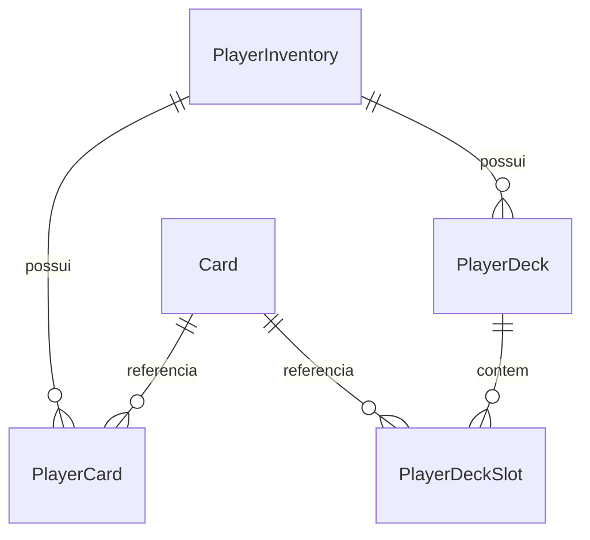

# inventory-service

Gerencia o inventário dos jogadores: catálogo de cartas, cartas possuídas, evolução, decks e o **poder (power)** do jogador. Valida JWT nos endpoints REST e fornece o poder consumido pelo matchmaking. Desde a integração do battle-service, também expõe uma **API gRPC** (`GetBattleStats`) consumida pelo battle-service.

- **Porta interna:** 8080 (Compose: `http://localhost:8081`)
- **Banco:** PostgreSQL `onlinegame_inventory`
- **Solution:** `services/inventory-service/OnlineGame.InventoryService.sln`

## Responsabilidades

- Catálogo global de cartas (nome, descrição, dano base, raridade).
- Inventário por jogador: cartas possuídas, duplicatas, nível de evolução.
- Evolução de cartas consumindo duplicatas.
- Decks com slots que referenciam cartas do inventário.
- Poder do jogador (`Power`), lido pelo matchmaking.
- Concessão de cartas como recompensa.

## Modelo de domínio

`src/Core/Domain/Entities`. Enum `CardRarity`: `Common=1`, `Rare=2`, `Epic=3`, `Legendary=4`.

### `Card` (catálogo global)
`Id`, `Name` (<=100, único), `Description` (<=500), `BaseDamage` (1..100000), `Rarity`. Sem lógica de negócio.

### `PlayerInventory` (raiz por jogador)
`PlayerId` (PK), `BaseLevel`, `BaseHp`, `BaseAttack`, `Power`, `LastUpdate`, mais navegações `Cards` e `Decks`. Construtor inicializa `Power = BaseAttack`. Métodos:
- `Touch(timestamp)` - atualiza `LastUpdate`.
- `SetPower(newPower)` - valida `>= 0` (senão `ArgumentException`) e atualiza `LastUpdate`.

### `PlayerCard` (carta possuída)
PK composta `{PlayerId, CardId}`. `CurrentLevel`, `CountDuplicates`, `DateObtained`, `LastUpgrade?`, navegação `Card`. Regras:
- `AddDuplicates(amount)` - incrementa (exige `amount > 0`).
- `CanEvolve(n)` - `true` se `n > 0` e `CountDuplicates >= n`.
- `EvolveUsingDuplicates(n, date)` - `CurrentLevel++`, `CountDuplicates -= n`, `LastUpgrade = date`; lança se `!CanEvolve`.

### `PlayerDeck` / `PlayerDeckSlot`
`PlayerDeck`: `Id`, `PlayerId`, `Name` (<=100), lista `Slots`. `PlayerDeckSlot`: PK composta `{DeckId, SlotIndex}`, `CardId`. Regras de validação (no controller): `SlotIndex` único por deck; cada `CardId` deve existir no inventário do jogador; os slots são limpos e regravados a cada atualização.

## Endpoints

Todos exigem **Bearer JWT**. O `PlayerId` do path é confrontado com o claim `sub` do token (um jogador só acessa o próprio inventário). Erros no formato `ApiErrorResponse`.

### Cartas (`/api/cards`)
| Método | Rota | Descrição | Sucesso | Erros |
|--------|------|-----------|---------|-------|
| GET | `/api/cards` | Lista o catálogo (ordenado por nome) | 200 | 401 |
| POST | `/api/cards` | Cria carta (evita nome duplicado) | 201 | 409, 401 |

### Inventário (`/api/inventory/{playerId}`)
| Método | Rota | Descrição | Sucesso | Erros |
|--------|------|-----------|---------|-------|
| GET | `/{playerId}` | Inventário completo (cartas, decks, stats) | 200 | 404, 401 |
| POST | `/{playerId}/cards/{cardId}/reward` | Concede N cópias (`{amount}`) | 200 | 404, 401 |
| POST | `/{playerId}/cards/{cardId}/evolve` | Evolui consumindo `{duplicatesRequired}` | 200 | 404, 409, 401 |
| POST | `/{playerId}/decks` | Cria deck vazio (`{name}`) | 201 | 404, 401 |
| PUT | `/{playerId}/decks/{deckId}/slots` | Define slots (`{slots:[{slotIndex,cardId}]}`) | 200 | 404, 409, 401 |
| PUT | `/{playerId}/power` | Atualiza `{power}` (>= 0) | 200 | 400, 404, 401 |

`InventoryResponse` inclui `playerId`, `baseLevel`, `baseHp`, `baseAttack`, `power`, `lastUpdate`, `cards[]`, `decks[]`.

### Fluxos de negócio
- **Reward:** se a carta não está no inventário, cria em nível 1; senão soma duplicatas. `Touch` + persiste.
- **Evolve:** valida posse e duplicatas -> `EvolveUsingDuplicates` -> `Touch` + persiste.
- **Set deck slots:** valida unicidade de `slotIndex` e posse das cartas -> limpa e regrava slots.

> O campo `Power` hoje é apenas armazenado/atualizado; o cálculo automático a partir de cartas evoluídas e combates é trabalho futuro.

### API gRPC (para o battle-service)

Contrato em `proto/player_inventory.proto` (`Grpc.Tools` gera o stub servidor). Serviço `InventoryService`, método:

- **`GetBattleStats(player_id)` → `{ max_hp, base_damage, move_speed }`**. Deriva os atributos de combate a partir do inventário: `max_hp = BaseHp + Power/2 + BaseLevel*10`, `base_damage = BaseAttack + Power/4`, `move_speed = 5.0 + BaseLevel*0.2`. Retorna `NotFound` se o jogador não tem inventário, `InvalidArgument` se o `player_id` não é GUID.

O gRPC e o REST compartilham a **mesma porta 8080** (Kestrel configurado com `Http1AndHttp2`). O endpoint gRPC é **anônimo** (não passa pelo `[Authorize]` dos controllers REST): ponto de atenção de segurança, já que expõe stats de qualquer jogador sem credencial.

## Persistência

`InventoryDbContext`. PKs compostas em `PlayerCard` e `PlayerDeckSlot`, deletes em cascata, eager loading com `Include/ThenInclude` (evita N+1). Timestamps `timestamp with time zone` (UTC).

Migrations:
- `20260423214816_InitialCreate` - tabelas `Cards`, `PlayerInventories`, `PlayerCards`, `PlayerDecks`, `PlayerDeckSlots` + índices.
- `20260428195249_AddPowerToPlayerInventory` - adiciona coluna `Power` (default 0).

Seeders (idempotentes): `DatabaseSeeder` aplica migrations e chama `CardDataSeeder`, que insere 3 cartas de exemplo se ausentes:

| Nome | Dano base | Raridade |
|------|-----------|----------|
| Bola de Fogo | 80 | Common |
| Geada | 20 | Rare |
| Tempestade de Raios | 120 | Epic |

## Configuração

`ConnectionStrings:InventoryDb` (env `ConnectionStrings__InventoryDb` no Compose) e `Jwt:Secret` (env `Jwt__Secret`) - o mesmo segredo do auth, para validar tokens.

`Program.cs`: configura Kestrel com `Http1AndHttp2` (REST + gRPC na mesma porta), registra infraestrutura, **autenticação JWT Bearer** (valida assinatura HS256 e lifetime; sem validação de issuer/audience; clock skew 30s), gRPC (`AddGrpc`), Swagger com esquema Bearer, exception handler, seeders + migrations no boot, e pipeline com `UseAuthentication` -> `UseAuthorization` -> `MapGrpcService<InventoryGrpcService>` + `MapControllers`.

DI: `DbContext` (Npgsql) + repositórios Scoped (`ICardRepository`, `IPlayerInventoryRepository`, `IPlayerDeckRepository`).

## Dependências principais

`Microsoft.AspNetCore.Authentication.JwtBearer` 8.0.0, `Grpc.AspNetCore` 2.63.0, `Grpc.Tools` 2.63.0, `Google.Protobuf` 3.30.2, `Microsoft.EntityFrameworkCore` 8.0.0, `Npgsql.EntityFrameworkCore.PostgreSQL` 8.0.0, `System.IdentityModel.Tokens.Jwt` 7.5.1, `Swashbuckle.AspNetCore` 6.4.0.

## Build (Docker)

Multi-stage `sdk:8.0` -> `aspnet:8.0`, porta 8080, entry `OnlineGame.InventoryService.Api.dll`. **O contexto de build é a raiz do repositório** (não a pasta do serviço), porque o Dockerfile copia também `proto/` para gerar o stub gRPC.
