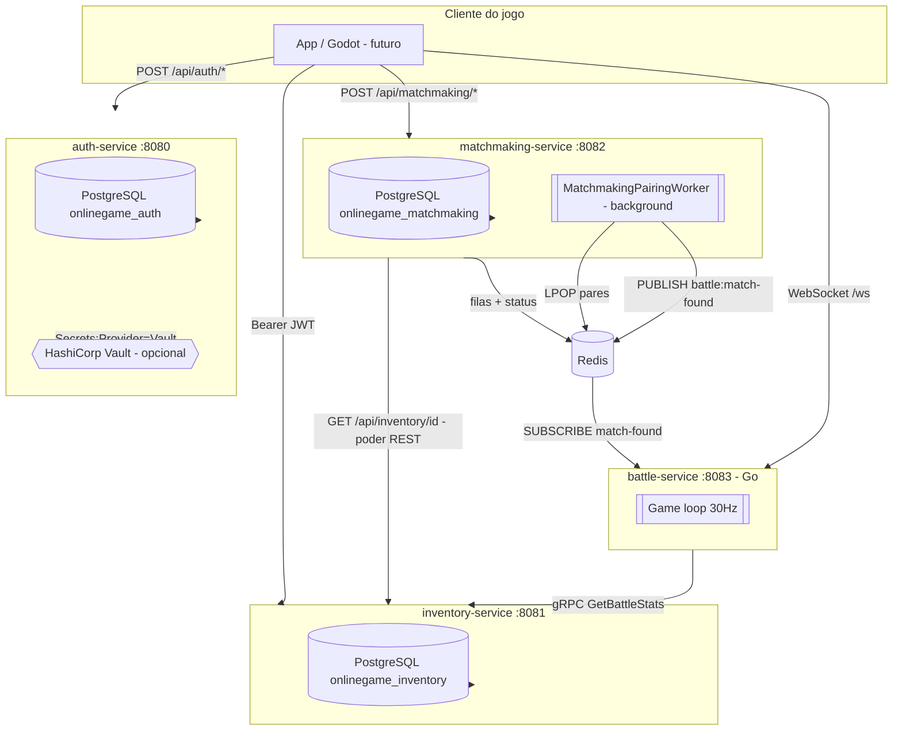
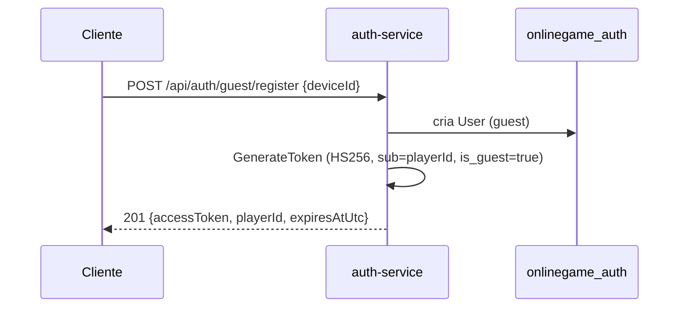
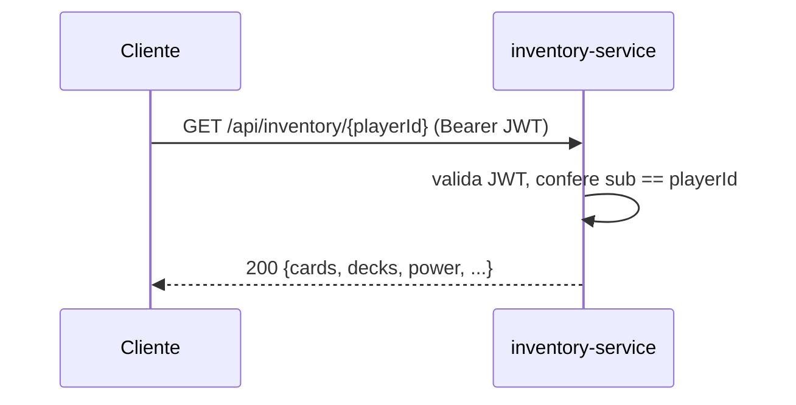
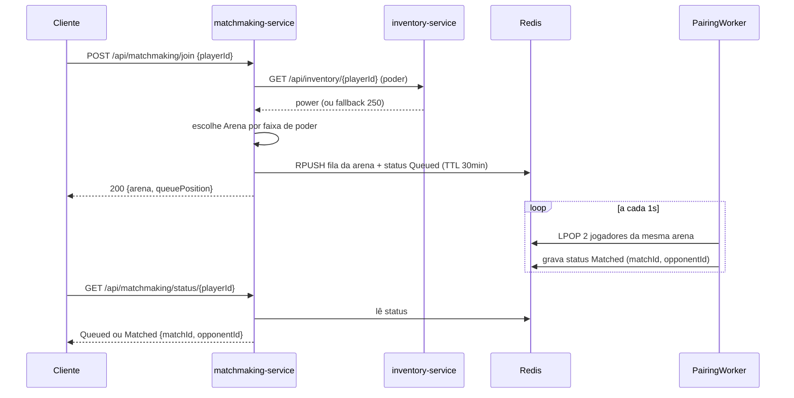
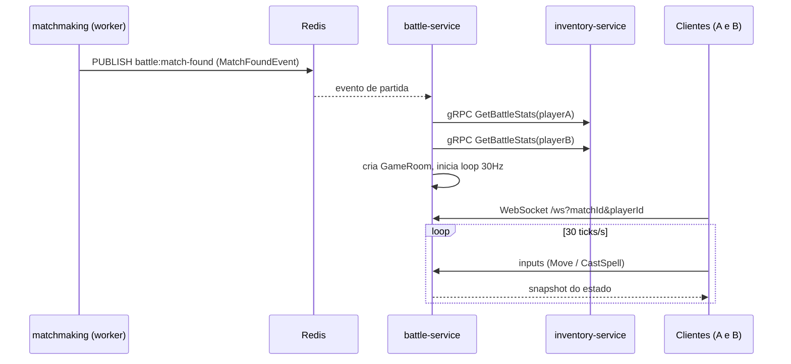

# Visão geral e arquitetura

## Contexto

O projeto é o backend de um jogo multiplayer online baseado em cartas. Ele existe como **testbed** para a pesquisa de mestrado cujo tema é mitigar vulnerabilidades em microsserviços orquestrados por Kubernetes com contramedidas criptográficas (mTLS, rotação de segredos, network policies). Ver [contexto da RSL](./Mestrado/RSL%20Parcial/main.md).

O estado atual do código é a **linha de base "Unprotected"** descrita no `deploy/README.md`: segredos e conexões em texto claro por design. Isso é intencional: representa o "antes" contra o qual as contramedidas serão aplicadas e medidas (por exemplo com Kube-bench / Kube-hunter).

## Princípios de arquitetura

Os três serviços C# (auth, inventory, matchmaking) seguem **Clean Architecture** com quatro camadas em projetos separados. O battle-service (Go) usa o layout idiomático `cmd/` + `internal/` (domain/engine/network/gateway), com a mesma intenção de isolar domínio das dependências externas.

```
Api             (apresentação: controllers, DTOs, middleware, Program.cs)
  -> Infrastructure   (EF Core, repositórios, Redis, clients HTTP, DI)
       -> Core/Application  (interfaces/casos de uso; sem dependências externas)
            -> Core/Domain      (entidades e regras de negócio; C# puro)
```

Regras:
- Dependências apontam sempre para o centro (domínio). O domínio não conhece EF, Redis nem HTTP.
- As interfaces (repositórios, provedores) vivem em `Core/Application`; as implementações concretas em `Infrastructure`.
- A camada `Api` é fina: valida entrada, chama a aplicação/infraestrutura e mapeia para DTOs.

Cada serviço C# tem **banco de dados próprio** (database-per-service); o battle-service não tem banco (é stateful só em memória durante a partida). Não há acesso cruzado a bancos. A integração entre serviços usa três mecanismos: **REST** (matchmaking → inventory), **gRPC** (battle → inventory) e **Redis Pub/Sub** (matchmaking → battle).

## Diagrama de componentes



## Papéis de segurança de cada serviço (estado atual)

| Serviço | Emite JWT | Valida JWT | Observação |
|---------|:---------:|:----------:|------------|
| auth-service | Sim | Não | Emite o token; os endpoints de login/registro são anônimos por natureza. O pipeline não registra `JwtBearer`. |
| inventory-service | Não | **Sim (REST)** | Endpoints REST exigem `Bearer` (HS256) e extraem `PlayerId` do claim `sub`. O endpoint **gRPC** `GetBattleStats` é **anônimo** (não passa por `[Authorize]`). |
| matchmaking-service | Não | **Não** | Ainda sem autenticação. `Program.cs` chama `UseAuthorization()` mas não há esquema de autenticação nem `[Authorize]`. Ponto de hardening. |
| battle-service | Não | **Não** | WebSocket autentica só por query params (`matchId`/`playerId`); chamada gRPC ao inventory é `insecure`. |

Os serviços C# compartilham, na baseline, o mesmo segredo simétrico HS256 (`CHANGE_ME_BASELINE_LOCAL_SECRET_32B` no Compose). Isso permite que o token emitido pelo auth seja validado pelo inventory.

> A adição do battle-service introduziu **gRPC** (battle → inventory) e **Redis Pub/Sub** (matchmaking → battle) como novos canais east-west. Isso amplia a superfície que a [feature flag de mTLS](./roadmap-seguranca.md) precisa cobrir; a análise de cobertura está no [README do mesh](../deploy/k8s/mesh/README.md).

## Fluxo ponta a ponta

### 1. Autenticação



O `playerId` retornado é a identidade usada nos demais serviços. Um guest pode depois virar conta registrada via `guest/link-account`, mantendo o mesmo `Id`.

### 2. Inventário (autenticado)



O `Power` do jogador é armazenado no inventário e é o insumo do matchmaking.

### 3. Matchmaking



O pareamento é simples: junta 2 jogadores consecutivos da mesma arena. Ao formar o par, o worker publica um `MatchFoundEvent` no canal Redis `battle:match-found`, que dispara a criação da partida no battle-service.

### 4. Batalha em tempo real



O cliente descobre a URL do WebSocket pelo `GET /api/matchmaking/status/{playerId}`, que agora devolve `battleWsUrl` quando a partida foi formada.

## Stack tecnológica

- **.NET 8 / C# 12**, ASP.NET Core (Controllers + Swagger) nos três serviços de backend.
- **Go 1.21** no battle-service (gorilla/websocket, go-redis, gRPC).
- **Entity Framework Core 8** + **Npgsql** (PostgreSQL 16).
- **Redis 7** (StackExchange.Redis / go-redis) para filas, status efêmero e Pub/Sub de partidas.
- **gRPC** (HTTP/2) para o fluxo battle → inventory (`Grpc.AspNetCore` no servidor; dynamic protobuf no cliente Go). Contrato em `proto/player_inventory.proto`.
- **WebSocket** para o tempo real cliente ↔ battle.
- **HashiCorp Vault** (opcional) como provedor de segredos do auth-service.
- **Docker** (multi-stage) e **Kubernetes** (namespace `onlinegame`, Kustomize por serviço). mTLS opcional via **Istio** (feature flag).

## Estrutura do repositório

```
microservices-game-testbed/
├── deploy/
│   ├── docker-compose.yml        # stack local completa
│   ├── README.md
│   └── k8s/                      # manifests por serviço (kustomize)
│       ├── auth-service/
│       ├── inventory-service/
│       └── matchmaking-service/
├── proto/
│   └── player_inventory.proto    # contrato gRPC compartilhado (inventory <-> battle)
├── services/
│   ├── auth-service/
│   ├── inventory-service/
│   ├── matchmaking-service/
│   └── battle-service/           # Go
└── docs/                         # esta documentação
```
